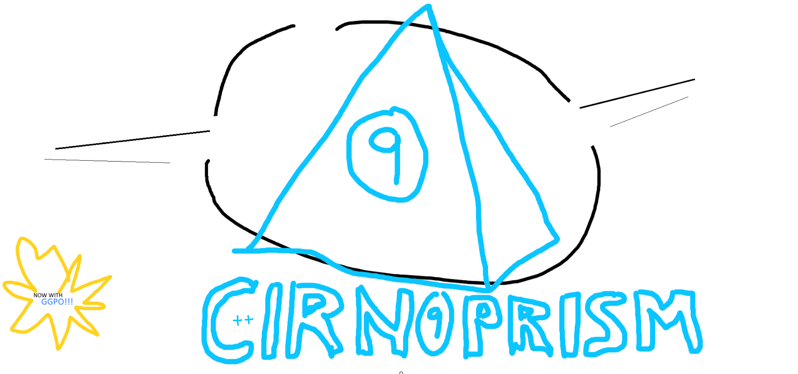

# cirnoprism

An experiment with integrating GGPO with a very rudimentary first-person 3D game renderer (GLFW/OpenGL).

## Building from CMake
-todo-

### Required build dependencies
GLEW 
GLFW 
GLM 
SOIL2 
OpenAL-soft 